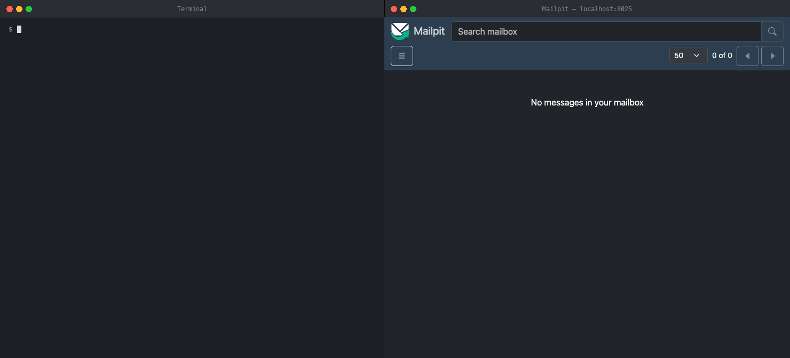
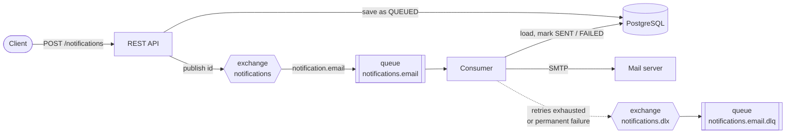

# Notification Service

[](https://github.com/otaldoneto/notification-service/actions/workflows/ci.yml)
[](https://codecov.io/gh/otaldoneto/notification-service)

Asynchronous e-mail notification service built with Spring Boot and RabbitMQ. The API accepts a notification, answers
right away and sends the e-mail in the background, with retries, a dead letter queue and protection against
duplicate deliveries.



## How it works



1. `POST /notifications` validates the request, stores the notification as `QUEUED` and publishes only its id to
   RabbitMQ. The client gets `202 Accepted` immediately.
2. The consumer loads the notification from the database and sends the e-mail. On success it is marked `SENT`.
3. A temporary failure (the mail server is down) is retried 3 times, waiting 1s, 2s and 4s.
4. When the retries run out, or the failure is permanent (unreadable message, malformed address, unknown id), the
   notification is marked `FAILED` and the message goes to the dead letter queue with the error in its headers.
5. `GET /notifications/{id}` shows the current status at any time.

## Features

- **Asynchronous processing**: the API never waits for the mail server
- **Retries with exponential backoff** for temporary failures, and no retries for permanent ones
- **Dead letter queue** keeping every failed message with its failure reason (`x-exception-message`)
- **Idempotent consumer**: a redelivered message never sends the same e-mail twice
- **Status tracking** (`QUEUED`, `SENT`, `FAILED`) with the last error, queryable through the API
- **Honest responses**: if RabbitMQ is down the API answers `503` instead of a false "queued"
- Errors in the [Problem Details](https://www.rfc-editor.org/rfc/rfc9457) format
- Health check that stays `UP` while the mail server is down, since e-mails wait in the queue

## Tech stack

- Java 25 and Spring Boot 4.1.1 (Web MVC, AMQP, Mail, Data JPA, Validation, Actuator)
- RabbitMQ 4
- PostgreSQL 18 and Flyway
- Mailpit (local SMTP server with a web inbox)
- JUnit 5, Mockito, AssertJ, Awaitility and Testcontainers
- Docker, Docker Compose and GitHub Actions

## Getting started

Requirements: Docker.

```bash
git clone https://github.com/otaldoneto/notification-service.git
cd notification-service
docker compose up -d --build
```

This starts the API, PostgreSQL, RabbitMQ and Mailpit:

| Service | URL |
|---|---|
| API | http://localhost:8080 |
| Mailpit inbox | http://localhost:8025 |
| RabbitMQ management UI | http://localhost:15672 (user `guest`, password `guest`) |

Send a notification:

```bash
curl -i -X POST http://localhost:8080/notifications \
  -H 'Content-Type: application/json' \
  -d '{"to":"client@example.com","subject":"Your order is ready","body":"Order #42 is ready for pickup."}'
```

Then open the Mailpit inbox to see the e-mail, and check its status with the `id` from the response:

```bash
curl http://localhost:8080/notifications/<id>
```

To see the retries and the dead letter queue in action, stop the mail server with `docker compose stop mailpit`, send
a notification and watch the logs (`docker compose logs -f app`): after four attempts the notification becomes
`FAILED` and the message shows up in `notifications.email.dlq` in the RabbitMQ UI. Start it again with
`docker compose start mailpit`.

Stop everything with `docker compose down` (add `-v` to also delete the database).

### Running the application from the IDE

Start only the infrastructure and run the application with Maven (requires JDK 25):

```bash
docker compose up -d postgres rabbitmq mailpit
./mvnw spring-boot:run
```

## API

### `POST /notifications`

```json
{ "to": "client@example.com", "subject": "Your order is ready", "body": "Order #42 is ready for pickup." }
```

| Status | Meaning |
|---|---|
| `202 Accepted` | Notification stored and queued. The body contains its `id` and `status: QUEUED` |
| `400 Bad Request` | Invalid e-mail address, or blank `subject` / `body` |
| `503 Service Unavailable` | RabbitMQ is unreachable. The notification is stored as `FAILED` |

### `GET /notifications/{id}`

```json
{
  "id": "7434c4af-7b3e-476e-a3b9-7e8fc90a8552",
  "to": "client@example.com",
  "subject": "Your order is ready",
  "status": "SENT",
  "lastError": null,
  "createdAt": "2026-09-23T20:30:16.640545Z",
  "sentAt": "2026-09-23T20:30:16.716241Z"
}
```

Returns `404 Not Found` for an unknown id.

## Design decisions

- **Only the id travels through the queue.** The database is the single source of truth for the content and the
  status, so a message can never carry stale data, and the consumer always knows whether the work was already done.
- **The row is committed before the message is published.** Publishing first could let the consumer receive an id
  that does not exist yet. If publishing fails, the notification is marked `FAILED` and the client gets `503`.
- **Transient and permanent failures are handled differently.** Retrying an unreadable message or an e-mail that
  cannot even be built (malformed address) would only delay the inevitable, so those go straight to the dead letter
  queue. Everything else, such as the mail server being down, is retried.
- **The failure is recorded before dead-lettering.** A custom `MessageRecoverer` marks the notification `FAILED` and
  then republishes the message to the dead letter exchange with the stack trace in its headers.
- **Tests run against real infrastructure.** Testcontainers starts PostgreSQL, RabbitMQ and Mailpit, so the retry,
  dead letter and duplicate delivery tests exercise the real broker behavior instead of mocks.

## Known limitations

- **At-least-once, not exactly-once.** RabbitMQ can redeliver a message and the consumer skips notifications that are
  already `SENT`. There is still a tiny window: if the application crashes after the mail server accepted the e-mail
  but before the status is saved, the e-mail is sent again on redelivery. No e-mail system can fully avoid this.
- **No transactional outbox.** The database write and the publish are two separate steps. If the broker is down the
  request fails cleanly with `503`, but a crash between the two steps would leave a notification `QUEUED` forever. An
  outbox table with a background publisher would close that gap.
- **Retries block the consumer while waiting.** They happen in memory on the consumer thread, which is fine for this
  volume. At higher volume, delayed retry queues (message TTL) would free the consumer between attempts.
- **Dead-lettered messages are not replayed automatically.** They stay in the dead letter queue for inspection.

## Tests

```bash
./mvnw test
```

Requires Docker, since the tests start real containers. The build fails if line coverage drops below 90% (JaCoCo);
the HTML report is written to `target/site/jacoco/index.html`.

The CI runs two jobs on every push and pull request: the test suite with coverage upload, and a Docker smoke test that
starts the whole stack and runs [`scripts/smoke-test.sh`](scripts/smoke-test.sh), which only passes when a
notification reaches the inbox and its status becomes `SENT`.

## Project structure

```
src/main/java/com/notification/service
├── api            REST controller, request/response records, error handling
├── config         RabbitMQ topology, retry policy, dead letter recoverer wiring
├── email          SMTP sender
├── messaging      publisher, consumer and dead letter recoverer
└── notification   entity, repository and the service holding the business rules
```

## License

[MIT](LICENSE)
